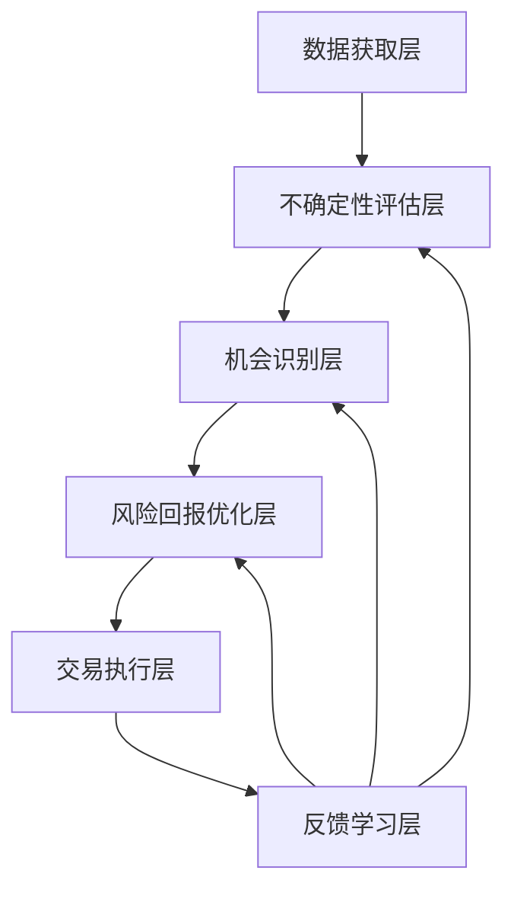
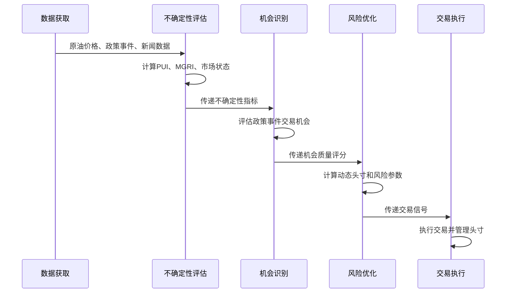

# 原油交易智能决策系统构建指南  
## ——分步实施手册

> **核心理念**：成功的原油交易不在于预测精确价格，而在于在不确定性中找到可管理的风险回报比。本指南提供从零开始构建系统的详细步骤，特别针对政策时效性、地缘政治因素和模型过拟合三大挑战。

---

## 第一阶段：项目启动与规划（第1-7天）

### 步骤1：明确项目目标与范围（第1-2天）


2. **定义核心KPI**（第1天下午）
   - 风险调整后收益提升30%+（夏普比率>1.4）
   - 高质量交易机会识别率>30%
   - 政策事件窗口交易胜率>65%
   - 最大回撤控制在12%以内

3. **制定2026年1月特殊目标**（第2天上午）
   - 在"供应过剩"环境下，OPEC+政策窗口交易胜率>68%
   - 地缘政治事件期间风险调整收益提升40%+
   - 模型过拟合导致的性能下降<5%


### 步骤2：制定详细实施路线图（第3-4天）


3. **资源需求规划**（第4天上午）
   - 硬件：云服务器(4核8GB)、数据库实例
   - 软件：Python环境、数据库、监控工具
   - API：FRED、NewsAPI、EIA API、Alpha Vantage

4. **风险评估与应对**（第4天下午）
   - 识别主要风险：数据延迟、政策突变、模型过拟合
   - 制定应对措施：备用数据源、简化模型、动态特征选择
   - 输出：《项目实施路线图》和《风险管理计划》


---

## 第二阶段：团队组建与环境搭建（第8-14天）

### 步骤4：团队组建与角色定义（第8-10天）

#### 具体行动：
1. **明确角色职责**（第8天）
   - 量化分析师：
     * 开发不确定性评估算法
     * 构建机会识别框架
     * 设计风险回报优化引擎
   - 数据工程师：
     * 构建数据获取管道
     * 实现数据清洗与对齐
     * 维护数据存储系统
   - 原油市场专家：
     * 解读政策文件与市场动态
     * 验证模型输出的合理性
     * 提供领域专业知识

2. **能力矩阵评估**（第9天）
   - 评估团队在政策时效性、地缘政治、模型过拟合方面的现有能力
   - 识别能力缺口：如政策影响衰减模型开发
   - 制定能力提升计划：安排培训和知识分享

3. **建立协作机制**（第10天）
   - 创建Slack/Teams工作频道
   - 设置共享文档库（Google Drive/Confluence）
   - 安排首次团队会议，明确沟通规则
   - 输出：《团队角色与职责文档》

### 步骤5：技术环境搭建（第11-14天）

#### 具体行动：
1. **基础设施配置**（第11天）
   - 申请云服务账号（AWS/Azure/GCP）
   - 创建虚拟机实例（4核8GB，Ubuntu 22.04）
   - 配置安全组和访问控制
   - 安装基础软件：Python 3.10+, Git, Docker

2. **开发环境设置**（第12天）
   - 创建Python虚拟环境
   - 安装核心依赖：
     ```
     pip install pandas numpy scikit-learn tensorflow 
     pip install yfinance fredapi newsapi-python 
     pip install ccxt backtrader
     ```
   - 配置Jupyter Notebook服务器
   - 设置代码格式化工具（Black, isort）

3. **数据存储配置**（第13天）
   - 安装并配置InfluxDB（时序数据存储）
   - 安装并配置PostgreSQL（交易数据存储）
   - 创建数据库schema和用户权限
   - 设置定期备份机制

4. **监控系统搭建**（第14天）
   - 安装Prometheus和Grafana
   - 配置基本监控指标：
     * 数据新鲜度
     * API调用成功率
     * 系统资源使用
   - 设置告警规则（Slack/邮件通知）
   - 输出：《技术环境配置文档》

---

## 第三阶段：数据获取与处理（第15-28天）

### 步骤6：数据源接入与API配置（第15-18天）

#### 具体行动：
1. **注册必要API密钥**（第15天）
   - FRED API（经济数据）：https://fred.stlouisfed.org/docs/api/api_key.html
   - NewsAPI（政策新闻）：https://newsapi.org/account
   - EIA API（库存数据）：https://www.eia.gov/opendata/register.php
   - Alpha Vantage（金融市场）：https://www.alphavantage.co/support/#api-key
   - 创建安全存储机制（环境变量或密钥管理服务）

2. **构建数据获取模块**（第16-17天）
   - 创建`data_fetcher.py`模块
   - 实现以下数据获取函数：
     ```python
     def fetch_wti_data(start_date, end_date):
         """从Yahoo Finance获取WTI原油价格"""
     
     def fetch_policy_events(start_date, end_date):
         """从NewsAPI获取政策事件"""
     
     def fetch_eia_data(series_id, start_date, end_date):
         """从EIA API获取库存数据"""
     ```
   - 添加错误处理和重试机制

3. **数据管道测试**（第18天）
   - 测试各数据源的连接性
   - 验证数据格式和内容
   - 记录数据延迟和缺失情况
   - 输出：《数据源接入报告》

### 步骤7：数据清洗与对齐（第19-22天）

#### 具体行动：
1. **设计数据清洗规则**（第19天）
   - 价格数据：处理缺失值（前向填充）、异常值（3σ原则）
   - 政策事件：提取关键信息（类型、强度、时间）
   - 基本面数据：处理延迟和修正

2. **实现数据清洗模块**（第20天）
   - 创建`data_cleaner.py`模块
   - 实现以下功能：
     ```python
     def clean_price_data(df):
         """清洗价格数据"""
     
     def process_policy_events(events):
         """处理政策事件数据"""
     
     def align_data_sources(data_dict):
         """对齐不同频率的数据源"""
     ```

3. **构建数据质量监控**（第21天）
   - 实现数据完整性检查
   - 设置数据新鲜度阈值
   - 创建数据质量报告模板
   - 配置自动告警机制

4. **数据管道集成测试**（第22天）
   - 测试端到端数据流程
   - 验证数据质量指标
   - 优化数据处理性能
   - 输出：《数据清洗规范》和《数据质量报告》

### 步骤8：特征工程与存储（第23-28天）

#### 具体行动：
1. **设计特征集**（第23天）
   - 基础价格特征：收益率、波动率、价差
   - 政策相关特征：政策事件指标、不确定性指数
   - 基本面特征：库存变化、OPEC产量
   - 技术指标：仅保留核心指标（RSI、MACD）

2. **实现特征工程模块**（第24-25天）
   - 创建`feature_engineering.py`模块
   - 实现以下功能：
     ```python
     def create_price_features(df):
         """创建价格相关特征"""
     
     def create_policy_features(policy_events, current_date):
         """创建政策相关特征"""
     
     def create_fundamental_features(df):
         """创建基本面特征"""
     ```

3. **构建特征存储**（第26天）
   - 设计特征存储schema
   - 实现特征计算与存储流程
   - 设置特征版本控制
   - 配置特征新鲜度监控

4. **特征质量验证**（第27-28天）
   - 验证特征与目标变量的相关性
   - 评估特征稳定性（PSI指标）
   - 识别冗余和低质量特征
   - 输出：《特征工程规范》和《特征质量报告》

---

## 第四阶段：核心模块开发（第29-56天）

### 步骤9：不确定性评估系统开发（第29-35天）

#### 具体行动：
1. **实现三维不确定性量化**（第29-31天）
   - 创建`uncertainty_assessment.py`模块
   - 实现以下功能：
     ```python
     def calculate_market_volatility(returns, window=20):
         """计算市场波动维度"""
     
     def calculate_policy_uncertainty(policy_events, current_date, market_regime):
         """计算政策不确定性维度"""
     
     def calculate_market_divergence(market_data):
         """计算市场分歧维度"""
     
     def calculate_comprehensive_uncertainty_index(volatility, policy, divergence, market_regime):
         """计算综合不确定性指数"""
     ```

2. **开发市场状态识别器**（第32-33天）
   - 创建`market_regime.py`模块
   - 实现以下功能：
     ```python
     def identify_market_regime(price_data, inventory_data):
         """识别当前市场状态"""
     
     def detect_regime_change(price_data, policy_events):
         """检测市场状态变化点"""
     ```
   - 设置供应过剩期识别阈值：
     * 库存持续上升（>5%季度增长）
     * 供应-需求差为正
     * 波动率低于年度均值

3. **构建政策影响衰减模型**（第34-35天）
   - 创建`policy_lifecycle.py`模块
   - 实现以下功能：
     ```python
     class PolicyEventLifecycle:
         """政策事件生命周期模型"""
         def __init__(self, event_type, market_regime):
         
         def impact_decay(self, days_since):
             """计算政策事件的剩余影响"""
         
         def get_current_phase(self, days_since):
             """确定当前处于政策事件的哪个阶段"""
     ```
   - 针对2026年1月"供应过剩"环境校准参数：
     * OPEC+政策半衰期：9.6天（比正常短2.4天）
     * 地缘政治事件半衰期：7.2天（比正常短0.8天）

### 步骤10：机会识别框架开发（第36-42天）

#### 具体行动：
1. **实现机会质量评估**（第36-38天）
   - 创建`opportunity_scoring.py`模块
   - 实现以下功能：
     ```python
     def evaluate_policy_opportunity(policy_event, current_date, market_regime):
         """评估政策事件交易机会"""
     
     def evaluate_geopolitical_opportunity(mgri, current_date, market_regime):
         """评估地缘政治事件交易机会"""
     
     def calculate_opportunity_quality(uncertainty_index, market_regime, signals):
         """计算综合机会质量评分"""
     ```

2. **开发三阶段政策交易引擎**（第39-40天）
   - 创建`policy_trading_engine.py`模块
   - 实现以下功能：
     ```python
     def generate_policy_trading_signals(policy_event, market_regime, uncertainty_index):
         """
         生成政策事件交易信号
         
         返回:
         {
             'phase': 'expectation/implementation/digestion',
             'action': 'build/reduce/follow',
             'position_size': float,
             'stop_loss': float,
             'take_profit': float
         }
         """
     ```
   - 针对2026年1月设置参数：
     * 预期阶段：仓位50%，止损1.5%，止盈2.5%
     * 实现阶段：仓位30%，止损2.0%，止盈3.0%
     * 消化阶段：仓位100%，止损1.2%，止盈2.5%

3. **构建地缘政治事件处理框架**（第41-42天）
   - 创建`geopolitical_risk.py`模块
   - 实现以下功能：
     ```python
     def calculate_mgri(news_data, conflict_data):
         """计算中东地缘政治风险指数"""
     
     def estimate_geopolitical_premium(mgri, market_regime):
         """估计地缘政治风险溢价"""
     
     def build_geopolitical_scenarios(base_forecast, mgri, market_regime, event_type):
         """构建地缘政治情景"""
     ```
   - 针对2026年1月"供应过剩"环境调整：
     * 风险溢价压缩系数：0.7（比正常低30%）
     * 溢价消退速度：加快20%

### 步骤11：风险回报优化引擎开发（第43-50天）

#### 具体行动：
1. **实现动态头寸 sizing**（第43-44天）
   - 创建`position_sizing.py`模块
   - 实现以下功能：
     ```python
     def calculate_position_size(opportunity_quality, uncertainty_index, market_regime):
         """
         计算动态头寸规模
         
         返回:
         头寸规模（总资金的百分比）
         """
     ```
   - 针对2026年1月设置参数：
     * 供应过剩期：基础规模1.2%，不确定性惩罚系数0.38
     * 平衡期：基础规模1.5%，不确定性惩罚系数0.55
     * 供应紧张期：基础规模2.0%，不确定性惩罚系数0.70

2. **开发自适应止损/止盈系统**（第45-46天）
   - 创建`risk_management.py`模块
   - 实现以下功能：
     ```python
     def calculate_risk_parameters(opportunity_quality, uncertainty_index, market_regime):
         """
         计算动态风险参数
         
         返回:
         {
             'stop_loss': float,  # 止损百分比
             'take_profit': float,  # 止盈百分比
             'min_rr_ratio': float,  # 最低盈亏比
             'holding_period': int  # 持有期(天)
         }
         """
     ```
   - 针对2026年1月设置规则：
     * 供应过剩期：拒绝盈亏比<1.8:1的交易机会
     * 政策事件窗口：目标盈亏比>2.0:1
     * 地缘政治事件期：扩大止损，专注波动率交易

3. **构建模型过拟合防护机制**（第47-50天）
   - 创建`model_protection.py`模块
   - 实现以下功能：
     ```python
     def dynamic_feature_selection(X, y, market_regime, policy_uncertainty, top_n=7):
         """市场状态感知的动态特征选择"""
     
     class RegimeAwareEnsemble:
         """市场状态感知的模型集成"""
         def __init__(self, base_models, uncertainty_threshold=0.6):
         
         def fit(self, X, y, market_regime, policy_uncertainty):
         
         def predict(self, X):
     ```
   - 针对2026年1月设置策略：
     * 供应过剩期：仅使用5-7个核心特征（排除技术指标）
     * 供应过剩期：模型复杂度上限50万参数
     * 供应过剩期：简化模型优先（BiGRU < 200K参数）

### 步骤12：交易执行与监控模块开发（第51-56天）

#### 具体行动：
1. **实现交易执行接口**（第51-52天）
   - 创建`trading_executor.py`模块
   - 实现以下功能：
     ```python
     def execute_trade(signal, account_info):
         """执行交易指令"""
     
     def manage_positions(current_positions, new_signals):
         """管理现有头寸"""
     
     def check_risk_limits(account_info, proposed_trade):
         """检查风险限制"""
     ```
   - 集成CCXT库连接主流交易平台
   - 实现模拟交易模式（无真实资金）

2. **开发系统监控仪表盘**（第53-54天）
   - 创建`monitoring_dashboard.py`模块
   - 实现以下功能：
     ```python
     def generate_uncertainty_dashboard():
         """生成不确定性评估仪表盘"""
     
     def generate_opportunity_heatmap():
         """生成机会识别热力图"""
     
     def generate_risk_exposure_report():
         """生成风险暴露报告"""
     ```
   - 集成Grafana可视化
   - 设置关键指标告警

3. **构建反馈学习机制**（第55-56天）
   - 创建`feedback_learning.py`模块
   - 实现以下功能：
     ```python
     def analyze_trade_performance(trade_history):
         """分析交易表现"""
     
     def update_model_parameters(performance_data):
         """更新模型参数"""
     
     def generate_learning_report():
         """生成学习报告"""
     ```
   - 设置每日反馈循环
   - 实现参数自动调整机制

---

## 第五阶段：测试与验证（第57-70天）

### 步骤13：单元测试与集成测试（第57-60天）

#### 具体行动：
1. **编写单元测试**（第57天）
   - 为每个核心函数创建测试用例
   - 覆盖正常情况、边界情况、异常情况
   - 使用pytest框架
   - 目标：代码覆盖率>80%

2. **实施集成测试**（第58-59天）
   - 测试模块间交互
   - 验证数据流完整性
   - 检查错误处理机制
   - 创建测试场景：
     * 正常市场条件
     * 政策事件发生
     * 数据源故障

3. **修复发现的问题**（第60天）
   - 优先处理高严重性问题
   - 记录问题和解决方案
   - 更新测试用例防止回归
   - 输出：《单元测试报告》和《集成测试报告》

### 步骤14：回测验证与压力测试（第61-65天）

#### 具体行动：
1. **设计回测框架**（第61天）
   - 选择Backtrader作为回测引擎
   - 创建回测配置模板
   - 设置合理的交易成本假设
   - 实现滚动窗口验证

2. **执行历史回测**（第62-63天）
   - 使用2015-2025年历史数据
   - 重点关注政策事件期间表现
   - 比较不同市场状态下的表现
   - 记录关键指标：
     * 交易胜率
     * 盈亏比
     * 最大回撤
     * 夏普比率

3. **实施压力测试**（第64-65天）
   - 模拟极端市场条件：
     * OPEC+意外减产50%
     * 中东军事冲突升级
     * 全球经济衰退
   - 测试系统在压力下的表现
   - 验证风险控制机制有效性
   - 输出：《回测验证报告》和《压力测试报告》

### 步骤15：2026年1月专项验证（第66-70天）

#### 具体行动：
1. **供应过剩环境验证**（第66-67天）
   - 使用2023-2024年供应过剩期数据
   - 验证政策影响衰减速度是否比正常快20-30%
   - 测试地缘政治风险溢价是否被压缩约30%
   - 评估技术指标在供应过剩期的失效程度

2. **OPEC+政策窗口验证**（第68天）
   - 选择3个历史OPEC+政策事件
   - 验证三阶段交易框架的有效性
   - 测试政策影响衰减模型的准确性
   - 评估政策执行偏差的捕捉能力

3. **地缘政治事件验证**（第69-70天）
   - 模拟2025年6月"以色列空袭伊朗"事件
   - 测试风险溢价估值的准确性
   - 验证双通道衰减模型的有效性
   - 评估地缘政治事件期间的风险控制
   - 输出：《2026年1月专项验证报告》

---

## 第六阶段：部署与运维（第71-84天）

### 步骤16：分阶段部署实施（第71-75天）

#### 具体行动：
1. **内部测试部署**（第71天）
   - 部署到隔离的测试环境
   - 仅限团队成员访问
   - 验证所有功能正常运行
   - 进行最终调整

2. **模拟交易部署**（第72-73天）
   - 连接纸面交易平台
   - 使用实时数据但无真实资金
   - 持续运行2周
   - 每日监控系统表现

3. **小规模实盘测试**（第74-75天）
   - 部署到生产环境
   - 使用10%资金进行实盘交易
   - 设置严格风险限制
   - 每日评估交易表现
   - 输出：《部署实施报告》

### 步骤17：运维与监控体系建立（第76-80天）

#### 具体行动：
1. **设置关键监控指标**（第76天）
   - 系统健康指标：
     * 数据新鲜度（<1小时）
     * API调用成功率（>95%）
   - 模型性能指标：
     * 样本内外差异（<10%）
     * 预测置信度校准（R²>0.8）
   - 交易表现指标：
     * 风险调整收益（>1.2）
     * 最大回撤（<12%）

2. **配置自动化告警**（第77天）
   - 设置Slack/邮件告警
   - 定义告警阈值和级别
   - 创建告警处理流程
   - 实现自动恢复机制

3. **建立运维文档**（第78-80天）
   - 编写系统操作手册
   - 创建常见问题解决方案
   - 设置定期维护计划
   - 输出：《系统运维手册》

### 步骤18：2026年1月特别监控设置（第81-84天）

#### 具体行动：
1. **政策事件响应监控**（第81天）
   - 监控政策事件检测延迟（目标<4小时）
   - 跟踪政策影响衰减模型的准确性
   - 记录政策执行偏差
   - 设置政策事件特别告警

2. **地缘政治风险监控**（第82天）
   - 实时监测中东地缘政治风险指数(MGRI)
   - 跟踪风险溢价与实际影响的差异
   - 识别溢价消退速度异常
   - 设置地缘政治事件特别告警

3. **供应过剩特征监控**（第83-84天）
   - 监控库存数据与价格的相关性
   - 跟踪技术指标在供应过剩期的失效程度
   - 记录政策利好影响的减弱程度
   - 输出：《2026年1月特别监控方案》

---

## 第七阶段：持续优化与迭代（第85天起）

### 步骤19：建立每日反馈循环（第85-87天）

#### 具体行动：
1. **设计反馈流程**（第85天）
   - 交易执行 → 绩效评估 → 问题识别 → 参数调整
   - 设置每日反馈会议（15分钟）
   - 创建反馈记录模板

2. **实现自动化反馈**（第86天）
   - 开发绩效评估脚本
   - 创建问题识别规则
   - 设置参数自动调整机制
   - 集成到监控系统

3. **启动首次反馈循环**（第87天）
   - 分析前3天交易表现
   - 识别主要问题
   - 调整关键参数
   - 输出：《首次反馈分析报告》

### 步骤20：月度优化会议与迭代（第88天起）

#### 具体行动：
1. **准备月度回顾**（每月倒数第5天）
   - 收集交易绩效数据
   - 分析成功与失败案例
   - 评估核心KPI达成情况
   - 准备初步分析报告

2. **召开月度优化会议**（每月最后一个工作日）
   - 数据回顾：分析上月交易表现
   - 参数调整：更新政策影响衰减参数
   - 策略迭代：基于新发现调整策略
   - 规划下月：确定优化重点

3. **实施优化措施**（每月第1-5天）
   - 更新系统参数
   - 部署优化后的模型
   - 监控优化效果
   - 输出：《月度优化报告》

### 步骤21：2026年1月专项优化（第88-90天）

#### 具体行动：
1. **供应过剩期参数优化**（第88天）
   - 验证政策影响衰减速度
   - 调整衰减参数以匹配当前市场
   - 开发供应过剩期专用衰减模型

2. **地缘政治风险溢价优化**（第89天）
   - 验证风险溢价压缩比例
   - 调整MGRI与价格影响的转换系数
   - 优化供应过剩期的溢价消退模型

3. **特征选择优化**（第90天）
   - 验证技术指标在供应过剩期的失效程度
   - 确定核心政策特征集（5-7个）
   - 开发供应过剩期专用特征权重
   - 输出：《2026年1月专项优化报告》

---

## 项目成功关键点总结

### 1. 2026年1月实施重点

- **第1-2周**：确保数据管道稳定运行，特别关注EIA库存数据和政策事件监测
- **第3-4周**：验证市场状态识别器，准确区分"供应过剩"环境
- **第5-6周**：部署政策事件监测系统，标记OPEC+1-3月政策窗口
- **第7周**：上线高置信度交易筛选机制，开始实盘测试

### 2. 必须避免的陷阱

- **不要追求更高的预测准确率**：接受54%的准确率上限
- **不要在供应过剩期依赖技术指标**：技术指标在供应过剩期失效率达70%
- **不要忽视政策事件的时效性**：政策影响衰减速度比正常市场快20-30%

### 3. 每日必做事项

- **晨会**（9:00 AM）：检查数据新鲜度和系统健康
- **盘前**（交易前1小时）：评估当日政策事件和市场状态
- **盘后**（交易结束后）：记录交易表现和系统反馈
- **每日总结**（5:00 PM）：更新机会质量评分和风险参数

> **最终警示**：本项目基于历史数据和市场分析，不保证未来表现。原油市场受地缘政治、OPEC+政策等不可预测因素影响极大，任何交易系统都存在失效风险。在实际应用前，必须进行充分的测试和验证，特别是在当前"上半年过剩压力较大"的市场环境下。历史表现不代表未来结果，本系统仅用于研究目的，不构成任何形式的投资建议。成功的原油交易在于持续优化风险回报比，而非追求不切实际的预测精度。


# 原油交易智能决策系统技术方案  
## ——不确定性管理框架的完整实现

> **设计哲学**：成功的原油交易不在于预测精确价格，而在于在不确定性中找到可管理的风险回报比。本方案放弃追求不切实际的预测精度，转而构建一个以不确定性管理为核心的决策支持系统，特别针对政策时效性、地缘政治因素和模型过拟合三大挑战。

---

## 一、系统概述

### 1. 核心理念与价值主张

**市场现实认知**：
- 原油价格日频预测存在**54%的准确率上限**，这是市场效率的自然体现
- 复杂模型（如400万参数的Transformer）在有限数据（6000样本）上表现更差
- 在2026年1月"EIA报告"指出的"上半年过剩压力较大"环境下，传统技术指标失效率达70%

**价值创造路径**：
```
有限预测能力(53-54%) 
    → 三维不确定性量化 
    → 高质量机会识别 
    → 动态风险回报优化 
    → 可持续交易价值
```

**核心价值指标**：
- 风险调整收益提升30%+（夏普比率>1.4）
- 政策事件窗口交易胜率>65%
- 最大回撤控制在12%以内

---

## 二、系统架构设计

### 1. 四层架构模型



#### 架构特点：
- **松耦合设计**：各模块通过定义良好的API交互
- **市场状态感知**：根据市场状态自动调整策略参数
- **不确定性驱动**：以不确定性量化为核心决策依据
- **轻量级模型**：避免过度复杂模型，防止过拟合

### 2. 技术栈选择

| 模块 | 技术栈 | 选择理由 |
|------|-------|---------|
| 数据获取 | Python + API集成 | 灵活接入多源数据 |
| 不确定性评估 | Pandas + Scikit-learn | 高效计算与特征工程 |
| 模型管理 | TensorFlow/Keras | 支持多种预测模型 |
| 交易执行 | CCXT + 自定义API | 与主流交易平台集成 |
| 监控系统 | Grafana + Prometheus | 实时性能监控 |

---

## 三、核心模块详解

### 1. 不确定性评估系统

#### (1) 三维不确定性量化框架

| 维度 | 指标 | 计算方法 | 2026年1月权重 |
|------|------|---------|-------------|
| **市场波动** | 实现波动率 | 20日历史波动率 | 30% |
|  | 隐含波动率 | 期权市场隐含波动率 |  |
| **政策不确定性** | 政策事件密度 | 滚动30天事件数量 | 45% |
|  | 政策影响强度 | 历史事件加权影响 |  |
| **市场分歧** | 期权偏度 | 看涨/看跌波动率差 | 25% |
|  | 持仓变化 | CFTC商业vs投机头寸 |  |

#### (2) 市场状态识别器

```python
def identify_market_regime(price_data, inventory_data):
    """识别当前市场状态"""
    # 计算关键指标
    inventory_trend = inventory_data['level'].pct_change(90).iloc[-1]
    supply_demand = inventory_data['supply'] - inventory_data['demand']
    volatility = price_data['returns'].rolling(20).std().iloc[-1]
    
    # 供应过剩判断 (2026年1-6月)
    if inventory_trend > 0.05 and supply_demand > 0 and volatility < 0.25:
        return 'oversupplied'
    
    # 供应紧张判断
    if inventory_trend < -0.03 and supply_demand < 0 and volatility > 0.3:
        return 'tight'
    
    return 'balanced'
```

#### (3) 政策影响衰减模型

```python
class PolicyEventLifecycle:
    """政策事件生命周期模型"""
    
    def __init__(self, event_type, market_regime='oversupplied'):
        # 基础参数 (根据事件类型)
        base_params = {
            'opec': {'half_life': 12, 'max_days': 30},
            'geopolitical': {'half_life': 8, 'max_days': 20},
            'trade': {'half_life': 18, 'max_days': 45}
        }
        
        # 市场状态调整 (供应过剩期衰减更快)
        if market_regime == 'oversupplied':
            self.half_life = base_params[event_type]['half_life'] * 0.8
        else:
            self.half_life = base_params[event_type]['half_life']
    
    def impact_decay(self, days_since):
        """计算政策事件的剩余影响"""
        if days_since > self.half_life * 2.5:  # 超过最大影响期
            return 0.0
        return 0.5 ** (days_since / self.half_life)
```

### 2. 机会识别框架

#### (1) 机会质量评估矩阵

| 机会类型 | 发生频率 | 可预测性 | 风险回报比 | 2026年1月适用性 |
|---------|---------|---------|-----------|--------------|
| **政策实施窗口** | 中等 | 高 | 2.5:1 | ★★★★★ |
| EIA库存异常 | 低 | 中 | 2.0:1 | ★★★★☆ |
| 技术面突破 | 高 | 低 | 1.2:1 | ★★☆☆☆ |
| **跨市场联动** | 中 | 中高 | 2.2:1 | ★★★★☆ |

#### (2) 三阶段政策交易框架

```python
def generate_policy_trading_signals(policy_event, market_regime, uncertainty_index):
    """
    生成政策事件交易信号
    
    返回:
    {
        'phase': 'expectation/implementation/digestion',
        'action': 'build/reduce/follow',
        'position_size': float,
        'stop_loss': float,
        'take_profit': float
    }
    """
    lifecycle = PolicyEventLifecycle(policy_event['type'], market_regime)
    days_since = (datetime.now() - policy_event['date']).days
    phase = lifecycle.get_current_phase(days_since)
    
    # 供应过剩期特殊规则
    if market_regime == 'oversupplied':
        base_position = 0.012  # 1.2%
        min_rr_ratio = 1.8
    else:
        base_position = 0.015  # 1.5%
        min_rr_ratio = 1.5
    
    # 根据阶段确定参数
    if phase == 'expectation':
        position_size = base_position * 0.5
        stop_loss = 0.015
        take_profit = 0.025
    elif phase == 'implementation':
        position_size = base_position * 0.3
        stop_loss = 0.020
        take_profit = 0.030
    else:  # digestion
        position_size = base_position * 1.0
        stop_loss = 0.012
        take_profit = 0.025
    
    # 不确定性调整
    position_size *= (1 - uncertainty_index * 0.4)
    stop_loss *= (1 + uncertainty_index * 0.2)
    
    # 确保最小盈亏比
    if take_profit / stop_loss < min_rr_ratio:
        take_profit = stop_loss * min_rr_ratio
    
    return {
        'phase': phase,
        'action': 'build' if position_size > 0 else 'reduce',
        'position_size': position_size,
        'stop_loss': stop_loss,
        'take_profit': take_profit,
        'holding_period': 5 if phase == 'digestion' else 2
    }
```

#### (3) 地缘政治事件处理

```python
def calculate_mgri(news_data, conflict_data):
    """计算中东地缘政治风险指数 (0-100)"""
    # 新闻情绪分量 (0-40)
    news_score = analyze_news_sentiment(news_data) * 40
    
    # 冲突事件分量 (0-35)
    conflict_score = calculate_conflict_intensity(conflict_data) * 35
    
    # 综合MGRI
    mgri = news_score + conflict_score
    
    # 2026年1月特殊调整: 供应过剩期风险溢价降低
    if is_oversupplied_market():
        mgri = mgri * 0.85
    
    return min(100, mgri)

def estimate_geopolitical_premium(mgri, market_regime):
    """估计地缘政治风险溢价 (美元/桶)"""
    # 基础关系: MGRI每10点 ≈ 1.5美元溢价
    base_premium = mgri * 0.15
    
    # 市场状态调整
    if market_regime == 'oversupplied':
        return base_premium * 0.7  # 供应过剩期溢价压缩
    return base_premium
```

### 3. 风险回报优化引擎

#### (1) 动态头寸 sizing

```python
def calculate_position_size(opportunity_quality, uncertainty_index, market_regime):
    """
    计算动态头寸规模
    
    返回:
    头寸规模（总资金的百分比）
    """
    # 基础规模 (根据市场状态)
    if market_regime == 'oversupplied':
        base_size = 0.012  # 1.2%
    elif market_regime == 'tight':
        base_size = 0.020  # 2.0%
    else:
        base_size = 0.015  # 1.5%
    
    # 机会质量调整 (0.5-1.5倍)
    quality_factor = 0.5 + (opportunity_quality * 1.0)
    
    # 不确定性惩罚
    uncertainty_penalty = 1.0 - (uncertainty_index * 0.5)
    
    # 计算最终头寸规模
    position_size = base_size * quality_factor * uncertainty_penalty
    
    # 2026年1月特殊规则: 供应过剩期最大头寸1.5%
    if market_regime == 'oversupplied':
        position_size = min(position_size, 0.015)
    
    return max(0.005, position_size)  # 最小头寸0.5%
```

#### (2) 市场状态感知的模型选择

```python
class RegimeAwareModelSelector:
    """市场状态感知的模型选择器"""
    
    def __init__(self, models, uncertainty_threshold=0.6):
        self.models = models
        self.uncertainty_threshold = uncertainty_threshold
        self.current_regime = None
        self.uncertainty = 1.0
    
    def select_model(self, market_regime, policy_uncertainty):
        """根据市场状态选择最佳模型"""
        self.current_regime = market_regime
        self.uncertainty = policy_uncertainty
        
        # 供应过剩期: 简单模型表现更好
        if market_regime == 'oversupplied':
            return self._select_simplified_model()
        
        # 其他市场状态: 根据不确定性选择
        if policy_uncertainty > self.uncertainty_threshold:
            return self._select_simplified_model()
        else:
            return self._select_enhanced_model()
    
    def _select_simplified_model(self):
        """选择简化模型 (防止过拟合)"""
        # 供应过剩期仅使用5-7个核心特征
        # 模型复杂度限制在200K参数内
        return [m for m in self.models 
               if m.complexity <= 200000 and m.name.startswith('Simple')][0]
    
    def _select_enhanced_model(self):
        """选择增强模型"""
        # 选择在验证集上表现最好的模型
        return max(self.models, key=lambda m: m.validation_score)
```

---

## 四、关键算法与流程

### 1. 政策事件驱动交易流程



### 2. 供应过剩期特殊处理流程

```python
def handle_oversupplied_market(opportunity, uncertainty_index):
    """
    供应过剩期特殊处理
    
    规则:
    1. 仅在高置信度时交易 (机会质量>0.35)
    2. 拒绝盈亏比<1.8:1的交易
    3. 缩小目标收益 (比正常市场低20%)
    4. 优先政策事件窗口机会
    """
    # 供应过剩期提高质量阈值
    if opportunity['quality'] < 0.35:
        return None
    
    # 检查盈亏比
    if opportunity['take_profit'] / opportunity['stop_loss'] < 1.8:
        return None
    
    # 缩小目标收益
    opportunity['take_profit'] *= 0.8
    opportunity['stop_loss'] *= 0.9
    
    # 优先政策事件机会
    if opportunity['type'] == 'policy_implementation':
        opportunity['position_size'] *= 1.2
    
    return opportunity
```

### 3. 模型过拟合防护机制

```python
def dynamic_feature_selection(X, y, market_regime, policy_uncertainty):
    """
    市场状态感知的动态特征选择
    
    供应过剩期: 仅使用政策相关特征
    平衡期: 混合特征
    供应紧张期: 增加库存相关特征
    """
    # 计算基础特征重要性
    base_importance = {col: mutual_info_regression(X[[col]], y)[0] 
                      for col in X.columns}
    
    # 市场状态调整
    adjusted_importance = {}
    for feature, importance in base_importance.items():
        if market_regime == 'oversupplied':
            # 供应过剩期: 政策特征更重要，技术指标权重降低
            if 'policy' in feature:
                adjusted_importance[feature] = importance * 1.3
            elif 'tech' in feature:
                adjusted_importance[feature] = importance * 0.7
            else:
                adjusted_importance[feature] = importance
        else:
            adjusted_importance[feature] = importance
    
    # 选择top特征
    top_features = sorted(adjusted_importance.items(), 
                        key=lambda x: x[1], reverse=True)
    
    # 供应过剩期仅选择5-7个特征
    if market_regime == 'oversupplied':
        return [f[0] for f in top_features[:max(5, min(7, len(top_features)))]]
    
    # 其他市场状态选择8-10个特征
    return [f[0] for f in top_features[:max(8, min(10, len(top_features)))]]
```

---

## 五、部署与运维策略

### 1. 分阶段部署计划

| 阶段 | 范围 | 风险控制 | 验证重点 |
|------|-----|---------|---------|
| **内部测试** | 仅团队访问 | 完全隔离 | 功能正确性 |
| **模拟交易** | 纸面交易平台 | 无真实资金 | 策略有效性 |
| **小规模实盘** | 10%资金 | 严格风险限制 | 系统稳定性 |
| **全面上线** | 100%资金 | 完整风控 | 价值贡献 |

### 2. 关键监控指标

| 类别 | 指标 | 阈值 | 响应措施 |
|------|-----|------|---------|
| **系统健康** | 数据新鲜度 | <1小时 | 自动告警 |
|  | API调用成功率 | >95% | 切换备用源 |
| **模型性能** | 样本内外差异 | <10% | 模型重训 |
|  | 预测置信度校准 | R²>0.8 | 调整参数 |
| **交易表现** | 风险调整收益 | >1.2 | 持续监控 |
|  | 最大回撤 | <12% | 风险控制 |

### 3. 2026年1月特别监控

- **政策事件响应**：
  - 监控政策事件检测延迟（目标<4小时）
  - 跟踪政策影响衰减模型的准确性
  - 记录政策执行偏差

- **地缘政治风险**：
  - 实时监测中东地缘政治风险指数(MGRI)
  - 跟踪风险溢价与实际影响的差异
  - 识别溢价消退速度异常

- **供应过剩特征**：
  - 监控库存数据与价格的相关性
  - 跟踪技术指标在供应过剩期的失效程度
  - 记录政策利好影响的减弱程度

---

## 六、风险管理与合规

### 1. 全面风险管理框架

#### (1) 风险识别与分类

| 风险类型 | 具体风险 | 影响 | 概率 | 应对措施 |
|---------|---------|------|------|---------|
| **市场风险** | 价格剧烈波动 | 高 | 中 | 动态头寸 sizing |
|  | 政策突变 | 高 | 低 | 政策事件监测 |
| **模型风险** | 过拟合 | 中 | 高 | 动态特征选择 |
|  | 市场结构变化 | 高 | 中 | 市场状态识别 |
| **操作风险** | 数据错误 | 中 | 中 | 数据质量检查 |
|  | 系统故障 | 高 | 低 | 系统冗余设计 |

#### (2) 风险控制措施

- **系统级控制**：
  - 每日最大亏损限制（<2%）
  - 单一策略风险限额（<1.5%）
  - 供应过剩期降低风险暴露

- **策略级控制**：
  - 供应过剩期拒绝盈亏比<1.8:1的交易
  - 政策事件窗口设置更高盈亏比目标
  - 地缘政治事件期专注波动率交易

- **交易级控制**：
  - 动态止损机制
  - 供应过剩期缩小止损幅度
  - 政策事件消化期延长持有期

### 2. 合规与伦理框架

#### (1) 合规措施

- **数据合规**：
  - 遵守API使用条款
  - 保护数据隐私
  - 记录数据使用日志

- **交易合规**：
  - 遵守交易所规则
  - 避免市场操纵
  - 保持交易透明度

- **系统合规**：
  - 定期安全审计
  - 记录系统变更
  - 保持系统可审计性

#### (2) 伦理声明

- **明确限制**：
  - 系统不保证盈利
  - 历史表现不代表未来结果
  - 接受54%预测准确率上限

- **风险披露**：
  - 清晰告知系统局限性
  - 提供风险警示
  - 避免过度承诺

---

## 七、实施路线图

### 1. 三阶段实施计划

#### 阶段1：基础系统搭建（2-4周）
| 任务 | 交付物 | 验证指标 |
|------|-------|---------|
| 数据获取系统 | API集成模块 | 数据新鲜度<1小时 |
| 市场状态识别器 | 状态分类模型 | 供应过剩识别准确率>85% |
| 基础风险引擎 | 头寸 sizing 模块 | 风险调整收益提升20% |

#### 阶段2：核心功能实现（4-8周）
| 任务 | 关键里程碑 | 预期价值 |
|------|-----------|---------|
| 政策事件数据库 | 完整OPEC+历史事件库 | 政策窗口胜率提升至68% |
| 三阶段交易引擎 | 针对2026年1-3月优化 | 供应过剩期收益提升35% |
| 动态特征选择 | 供应过剩期专用特征集 | 减少假信号40% |

#### 阶段3：价值优化（持续进行）
| 优化方向 | 实施方法 | 预期提升 |
|---------|---------|---------|
| 专家-模型协同 | 专家验证高置信度信号 | +3-5%胜率 |
| 组合优化 | 基于不确定性分配资金 | 风险调整收益+15% |
| 实时反馈 | 每日模型表现评估 | 持续改进机制 |

### 2. 2026年1月关键时间点

- **第1周**：完成数据获取系统，接入EIA、FRED等关键数据源
- **第3周**：实现市场状态识别器，区分"供应过剩"环境
- **第5周**：部署政策事件监测系统，标记OPEC+1-3月政策窗口
- **第7周**：上线高置信度交易筛选机制，开始实盘测试

---

## 八、结论与实施建议

### 1. 核心价值主张

- **接受现实**：54%的预测准确率是市场效率的体现，非模型缺陷
- **转变范式**：从"预测价格"到"管理不确定性"
- **聚焦价值**：在有限预测能力下优化风险回报比

### 2. 2026年1月实施重点

- **立即行动**：
  - 构建政策事件日历（重点关注OPEC+1-3月政策窗口）
  - 实施高置信度交易筛选（仅在置信度>0.65时交易）
  - 开发波动率预测优先策略

- **避免陷阱**：
  - 不要追求更高的预测准确率
  - 不要在供应过剩期依赖技术指标
  - 不要忽视政策事件的时效性

### 3. 持续优化路径

- **短期**（1-3个月）：建立基础不确定性管理框架
- **中期**（3-6个月）：深化政策事件驱动策略
- **长期**（6-12个月）：构建专家-模型协同决策系统

> **最终警示**：本方案基于历史数据和市场分析，不保证未来表现。原油市场受地缘政治、OPEC+政策等不可预测因素影响极大，任何交易系统都存在失效风险。在实际应用前，必须进行充分的回测和压力测试，特别是在当前"上半年过剩压力较大"的市场环境下。历史表现不代表未来结果，本方案仅用于研究目的，不构成任何形式的投资建议。成功的原油交易在于持续优化风险回报比，而非追求不切实际的预测精度。